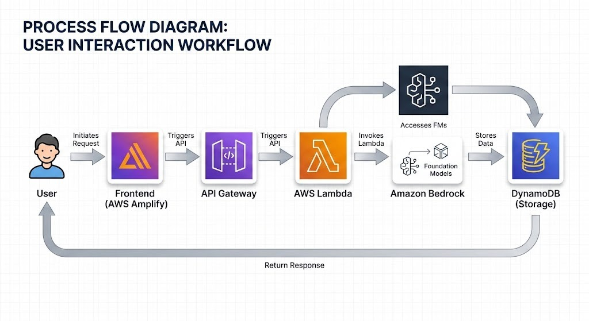

# 🚀 MODIFAI – Multi-Platform AI Content Optimization Engine

> AI-powered platform for transforming and optimizing content across multiple digital platforms using Amazon Bedrock.


MODIFAI is a secure, AWS-powered Multi-Platform AI Content Optimization Engine built for the AI for Bharat Hackathon.

It enables authenticated users to intelligently optimize, transform, and adapt content for multiple digital platforms using structured AI workflows powered by Amazon Bedrock.

---

## 🌐 Live Demo

👉 [https://main.d9htv620j2niu.amplifyapp.com/](https://main.d9htv620j2niu.amplifyapp.com/)

## 💻 GitHub Repository

👉 [https://github.com/anirudhm43/MODIFAI-Content-Transformer.git](https://github.com/anirudhm43/MODIFAI-Content-Transformer.git)

---

## 🧠 What MODIFAI Does

MODIFAI is not a generic chatbot. It is a multi-platform content optimization system that allows users to generate platform-ready content using AI-powered workflows.

### Users can:

* ✂️ Summarize long content for quick readability
* ✍️ Rewrite text professionally for formal communication
* 🌍 Localize content into different languages
* 📱 Optimize content for specific platforms (LinkedIn, Instagram, Email, etc.)
* 🎯 Adjust tone based on audience context (Professional, Casual, Trendy)
* 📊 Track AI response latency in real time
* 🕘 View personal AI interaction history

All AI interactions are securely authenticated and logged per user.

---

## 🏗 Full System Architecture

```
User
↓
AWS Amplify (Frontend)
↓
Amazon Cognito (Authentication)
↓
Amazon API Gateway
↓
AWS Lambda
↓
Amazon Bedrock
↓
Amazon DynamoDB
```

👉 For system architecture see 

---
## 🔐 Security Design

MODIFAI follows a secure-by-design architecture:

* Amazon Cognito User Pool authentication
* JWT-based API Gateway Authorizer
* User-specific data isolation in DynamoDB
* No public backend endpoints
* Production deployment over HTTPS

---

## 🚀 Tech Stack

### 🎨 Frontend

* React.js (Vite)
* Tailwind CSS
* AWS Cognito Authentication
* AWS Amplify Deployment

### ⚙ Backend (AWS Serverless)

* Amazon API Gateway
* AWS Lambda
* Amazon Bedrock (Foundation Models)
* Amazon DynamoDB
* Amazon Cognito

---

## ✨ Core Features

### 🔐 Secure Authentication

* Cognito Hosted UI login
* Access token validation
* Secure session persistence

### 🧠 AI Optimization Workflows

MODIFAI supports multiple structured AI workflows.

### ✂️ Content Summarization

Condenses long content into concise summaries while preserving key meaning.

### ✍️ Professional Rewrite

Rewrites text with improved clarity, grammar, and professional tone.

### 🌍 Language Localization

Translates content into other languages while maintaining context and meaning.

### 📱 Platform Optimization

Adapts content specifically for digital platforms such as:

* LinkedIn
* Instagram
* Twitter
* Blog
* Email

Each platform uses custom AI prompt engineering to produce platform-optimized results.

### 🎯 Tone Control

Platform optimization supports tone customization:

* Professional
* Casual
* Trendy

This enables audience-appropriate AI generated content.

### 📊 Real-Time AI Feedback

Users receive immediate feedback including:

* Loading indicators
* AI response output
* Error handling
* Latency measurement display

### 🕘 Interaction History

Each authenticated user has a personal AI history dashboard displaying:

* Mode used
* Platform selected
* Tone configuration
* Prompt input
* AI response output
* Request timestamp
* Response latency

---

## 🗃 DynamoDB Data Model

Each AI interaction stores:

* userId (Partition Key)
* createdAt (Sort Key)
* requestId
* modelId
* mode
* platform
* tone
* prompt
* response
* latencyMs
* status

This ensures:

* User-level data isolation
* Efficient chronological retrieval
* Scalable serverless architecture

---

## 🔄 Request Flow

1. User enters content in the React frontend.
2. Frontend sends a secured request to API Gateway.
3. API Gateway validates the JWT token via Cognito Authorizer.
4. Lambda processes the request and builds a structured AI prompt.
5. Amazon Bedrock generates optimized content.
6. The response is stored in DynamoDB.
7. The AI response and latency are returned to the frontend.

---

## ⚙️ Local Development Setup

### 1️⃣ Clone Repository

```bash
git clone https://github.com/anirudhm43/MODIFAI-Content-Transformer.git
cd .kiro/specs/ai-content-transformation/frontend

```

### 2️⃣ Install Dependencies

```bash
npm install

```

### 3️⃣ Run Development Server

```bash
npm run dev

```

App runs at: `http://localhost:5173`

---

## 🌍 Environment Configuration

Ensure your awsconfig.js contains:

* Cognito User Pool ID
* App Client ID
* AWS Region
* OAuth redirect URLs

⚠️ Update callback URLs in Cognito when deploying to production.

---

## 📈 Current Project Status

* ✅ Secure authentication system
* ✅ Multi-platform AI content optimization
* ✅ Platform-specific prompt engineering
* ✅ Tone customization
* ✅ DynamoDB interaction logging
* ✅ User history dashboard
* ✅ Real-time latency tracking
* ✅ Production deployment

---

## 🧭 How to Use MODIFAI

* Sign in using Cognito authentication.
* Enter content in the input box.
* Select an optimization workflow.
* Choose platform or language if required.
* Click Generate Optimized Content.
* View AI-generated results.
* Access previous interactions in History.

👉 For detailed instructions see [USER_GUIDE.md](USER_GUIDE.md)

---

## 🔮 Future Enhancements

Planned upgrades include:

* 📎 File attachment support
* 🎨 Tone adjustment slider
* 🌍 Dynamic language selection
* 📊 User analytics dashboard
* 📄 Export AI results to PDF
* ⚡ Response streaming
* 🧠 Custom prompt templates
* 🔐 Role-based access control
* 🚦 API rate limiting

---

## 🎯 Hackathon Positioning

MODIFAI demonstrates:

* Secure AI application architecture
* Serverless cloud-native backend
* Real-time LLM integration
* Platform-specific prompt engineering
* User-level data persistence
* Production-ready deployment

---

## 🏁 Conclusion

MODIFAI is a scalable AI-powered content optimization platform designed to help users generate platform-ready content efficiently.

Built using AWS serverless technologies and foundation models, it demonstrates how modern AI systems can deliver secure, structured, and production-ready intelligent applications.

---

## 📜 License

This project was developed for the **AI for Bharat Hackathon** and is available for educational and demonstration purposes.

---