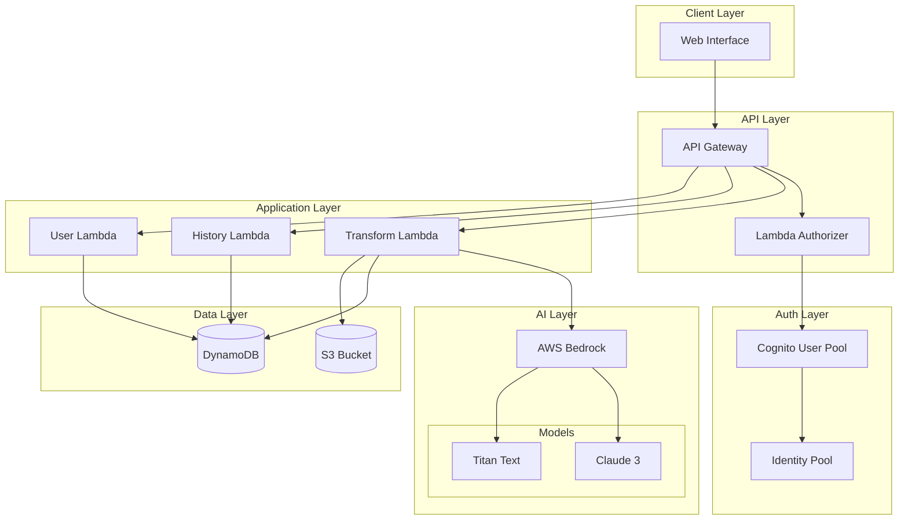
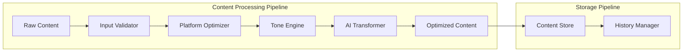
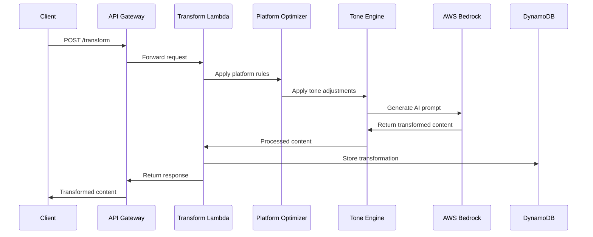
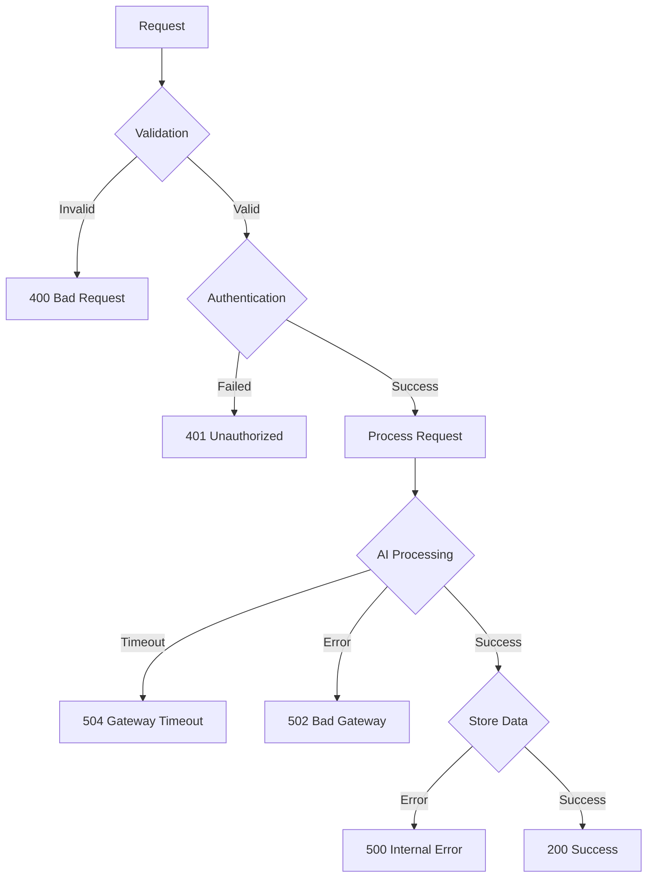

# Design Document: AI Content Transformation Engine

## Overview

MODIFAI is a serverless, cloud-native AI content transformation platform built on AWS that enables content creators to instantly optimize raw content for different social media platforms with customizable tones. The system leverages AWS Bedrock for AI processing, API Gateway for request management, Lambda for serverless compute, DynamoDB for data storage, and Cognito for authentication.

The architecture follows AWS Well-Architected Framework principles, ensuring scalability, security, cost-optimization, and high performance. The system processes user content through a pipeline that combines platform-specific optimization rules with AI-powered tone adjustment to generate tailored social media content.

## Architecture

### High-Level Architecture



### Component Architecture



## Components and Interfaces

### 1. API Gateway

**Purpose**: Serves as the unified entry point for all client requests, providing request routing, throttling, and CORS support.

**Configuration**:
- REST API with resource-based routing
- Request/response transformation
- Rate limiting: 1000 requests per minute per user
- CORS enabled for web client access
- Request validation and payload size limits (5MB max)

**Endpoints**:
- `POST /transform` - Content transformation
- `GET /history` - Retrieve transformation history
- `POST /auth/login` - User authentication
- `POST /auth/register` - User registration

### 2. Lambda Functions

#### Transform Lambda
**Purpose**: Orchestrates the content transformation pipeline by coordinating platform optimization, tone adjustment, and AI processing.

**Interface**:
```typescript
interface TransformRequest {
  content: string;
  platform: 'instagram' | 'linkedin';
  tone: 'professional' | 'casual' | 'trendy';
  userId: string;
}

interface TransformResponse {
  originalContent: string;
  transformedContent: string;
  platform: string;
  tone: string;
  processingTime: number;
  transformationId: string;
}
```

**Processing Flow**:
1. Validate input content and parameters
2. Apply platform-specific preprocessing rules
3. Generate AI prompt based on platform and tone requirements
4. Invoke AWS Bedrock for content transformation
5. Post-process AI response for platform compliance
6. Store transformation record in DynamoDB
7. Return transformed content to client

#### History Lambda
**Purpose**: Manages user content history retrieval, pagination, and content management operations.

**Interface**:
```typescript
interface HistoryRequest {
  userId: string;
  limit?: number;
  lastEvaluatedKey?: string;
}

interface HistoryResponse {
  transformations: TransformationRecord[];
  lastEvaluatedKey?: string;
  totalCount: number;
}
```

#### User Lambda
**Purpose**: Handles user profile management, preferences, and account operations.

### 3. AWS Bedrock Integration

**Purpose**: Provides AI-powered content transformation using foundation models optimized for text generation and content optimization.

**Model Selection Strategy**:
- **Primary**: Claude 3 Haiku for fast, cost-effective text transformation
- **Fallback**: Amazon Titan Text Express for high availability
- **Model switching**: The system is designed to support multiple foundation models, with a primary model used for transformations during the MVP phase.


**Prompt Engineering**:
```typescript
interface PromptTemplate {
  platform: string;
  tone: string;
  template: string;
  maxTokens: number;
  temperature: number;
}
```

**Platform-Specific Prompts**:
- **Instagram**: Focus on visual storytelling, hashtags, emojis, brevity
- **LinkedIn**: Professional language, value proposition, industry relevance

**Tone-Specific Adjustments**:
- **Professional**: Formal language, structured content, business terminology
- **Casual**: Conversational tone, relaxed structure, approachable language
- **Trendy**: Contemporary and informal expressions suitable for modern digital audiences

### 4. DynamoDB Data Model

**Purpose**: Provides scalable, low-latency storage for user data, content history, and system metadata.

#### Tables Design

**Users Table**:
```typescript
interface UserRecord {
  PK: string; // USER#{userId}
  SK: string; // PROFILE
  userId: string;
  email: string;
  createdAt: string;
  preferences: UserPreferences;
  subscriptionTier: string;
}
```

**Transformations Table**:
```typescript
interface TransformationRecord {
  PK: string; // USER#{userId}
  SK: string; // TRANSFORM#{timestamp}#{transformationId}
  transformationId: string;
  originalContent: string;
  transformedContent: string;
  platform: string;
  tone: string;
  createdAt: string;
  processingTime: number;
  GSI1PK: string; // TRANSFORM#{transformationId}
}
```

**Access Patterns**:
1. Get user profile: Query by PK = USER#{userId}, SK = PROFILE
2. Get user transformations: Query by PK = USER#{userId}, SK begins_with TRANSFORM#
3. Get specific transformation: Query by GSI1PK = TRANSFORM#{transformationId}

### 5. Amazon Cognito Authentication

**Purpose**: Provides secure user authentication, authorization, and session management.

**User Pool Configuration**:
- Email-based authentication
- Password policy: minimum 8 characters, mixed case, numbers
- MFA optional for enhanced security
- JWT token expiration: 1 hour (access), 30 days (refresh)

**Integration Pattern**:
- Client obtains JWT tokens from Cognito
- API Gateway Lambda Authorizer validates JWT tokens
- User context passed to Lambda functions for authorization

### 6. Platform Optimizer

**Purpose**: Applies platform-specific formatting rules and content optimization before AI processing.

**Instagram Optimization Rules**:
- Character limit: 2200 characters
- Hashtag integration: 5-10 relevant hashtags
- Emoji enhancement for visual appeal
- Line break optimization for readability
- Call-to-action placement

**LinkedIn Optimization Rules**:
- Professional formatting with clear structure
- Value-driven content focus
- Industry-relevant terminology
- Longer-form content support (up to 3000 characters)
- Professional networking context

### 7. Tone Engine

**Purpose**: Adjusts content linguistic style and tone based on user selection while preserving semantic meaning.

**Tone Transformation Logic**:
```typescript
interface ToneConfig {
  vocabulary: string[];
  sentenceStructure: 'formal' | 'casual' | 'dynamic';
  punctuationStyle: 'standard' | 'expressive' | 'minimal';
  personalization: 'third-person' | 'first-person' | 'direct';
}
```

## Data Models

### Content Transformation Flow



### Error Handling Flow



## Correctness Properties

*A property is a characteristic or behavior that should hold true across all valid executions of a system—essentially, a formal statement about what the system should do. Properties serve as the bridge between human-readable specifications and machine-verifiable correctness guarantees.*

Now I need to analyze the acceptance criteria to determine which ones can be tested as properties. Let me use the prework tool to analyze the requirements.

<function_calls>
<invoke name="prework">
<parameter name="featureName">ai-content-transformation

Based on the prework analysis, I've identified the following testable properties after eliminating redundancy:

**Property 1: Input Validation and Processing**
*For any* text input to the Content_Transformer, valid content should be accepted and processed while invalid content should be rejected with appropriate error messages
**Validates: Requirements 1.1, 1.3**

**Property 2: Content Length Handling**
*For any* content exceeding 5000 characters, the system should display a warning and prevent submission until the content is reduced

**Validates: Requirements 1.2**

**Property 3: Special Character Preservation**
*For any* content containing special characters or emojis, the Content_Transformer should preserve them appropriately throughout the transformation process
**Validates: Requirements 1.4**

**Property 4: Platform-Specific Optimization**
*For any* content and selected platform (Instagram or LinkedIn), the Platform_Optimizer should apply the correct platform-specific formatting rules, character limits, and styling conventions
**Validates: Requirements 2.2, 2.3, 2.4**

**Property 5: Tone Transformation Consistency**
*For any* content and selected tone (Professional, Casual, or Trendy), the Tone_Engine should apply consistent tone-specific language patterns and vocabulary while preserving the original message intent
**Validates: Requirements 3.2, 3.3, 3.4**

**Property 6: Response Time Performance**
*For any* valid transformation request, the Content_Transformer should process and return results within 10 seconds
**Validates: Requirements 4.1**

**Property 7: Platform and Tone Integration**
*For any* content transformation request, the output should reflect both the selected platform requirements and tone adjustments in a single coherent result
**Validates: Requirements 4.2**

**Property 8: AI Failure Resilience**
*For any* AI processing failure, the Content_Transformer should return appropriate error messages while maintaining system stability and availability
**Validates: Requirements 4.3, 8.5**

**Property 9: Content Display Completeness**
*For any* successful transformation, the User_Interface should display both original and transformed content along with all required metadata (platform, tone, processing time)
**Validates: Requirements 5.1, 5.5**

**Property 10: Long Content UI Handling**
*For any* content that exceeds display limits, the User_Interface should provide appropriate scrollable areas with clear formatting
**Validates: Requirements 5.4**

**Property 11: Content Storage Persistence**
*For any* authenticated user's content transformation, the Content_Store should save both original and transformed content pairs with proper encryption
**Validates: Requirements 6.1, 9.1**

**Property 12: History Retrieval and Ordering**
*For any* user's transformation history request, the Content_Store should retrieve and return transformations in chronological order within the specified performance limits
**Validates: Requirements 6.2, 9.2**

**Property 13: History Limit Management**
*For any* user with more than 100 transformations, the Content_Store should automatically maintain the limit by removing oldest entries when new ones are added
**Validates: Requirements 6.4, 6.5**

**Property 14: Authentication Workflow**
*For any* user registration, the Authentication_Service should require email verification before account activation and enforce password complexity requirements
**Validates: Requirements 7.1, 7.4**

**Property 15: Session Management**
*For any* user login attempt, the Authentication_Service should validate credentials and establish secure sessions with proper JWT token handling
**Validates: Requirements 7.2**

**Property 16: Concurrent Request Performance**
*For any* set of concurrent transformation requests, the system should maintain response times under 10 seconds per request
**Validates: Requirements 8.1**

**Property 17: Service Resilience and Recovery**
*For any* AI service unavailability, the Content_Transformer should handle AI service unavailability gracefully and notify users of temporary failures to maintain service availability
**Validates: Requirements 8.3**

**Property 18: Data Deletion Compliance**
*For any* user content deletion request, the Content_Store should permanently remove the data within the specified timeframe
**Validates: Requirements 9.5**

## Error Handling

### Error Classification

**Client Errors (4xx)**:
- 400 Bad Request: Invalid input format, missing required fields
- 401 Unauthorized: Invalid or expired authentication tokens
- 403 Forbidden: Insufficient permissions for requested operation
- 413 Payload Too Large: Content exceeds maximum size limits
- 429 Too Many Requests: Rate limiting exceeded

**Server Errors (5xx)**:
- 500 Internal Server Error: Unexpected application errors
- 502 Bad Gateway: AI service communication failures
- 503 Service Unavailable: System overload or maintenance
- 504 Gateway Timeout: AI processing timeout exceeded

### Error Response Format

```typescript
interface ErrorResponse {
  error: {
    code: string;
    message: string;
    details?: any;
    timestamp: string;
    requestId: string;
  };
}
```

### Failure Handling Strategy

**AI Service Integration**:
- Graceful handling of AI service failures
- Clear user-facing error messages for temporary issues
- Defensive timeouts to prevent request blocking

**Database Operations**:
- Basic retry handling for transient errors
- Error logging for operational visibility


## Testing Strategy

### Dual Testing Approach

The testing strategy employs both unit testing and property-based testing to ensure comprehensive coverage:

**Unit Tests**: Focus on specific examples, edge cases, and error conditions including:
- Specific platform formatting examples (Instagram hashtag integration, LinkedIn professional formatting)
- Authentication workflow edge cases (expired tokens, invalid credentials)
- Error handling scenarios (AI service failures, network timeouts)
- Integration points between components

**Property-Based Tests**: Verify universal properties across all inputs including:
- Content transformation consistency across different input types
- Platform optimization rules applied correctly for all content
- Performance characteristics under various load conditions
- Data persistence and retrieval accuracy

### Property-Based Testing Configuration

**Framework**: Use **fast-check** for JavaScript/TypeScript property-based testing
**Configuration**: Each property test runs minimum 100 iterations to ensure comprehensive input coverage
**Tagging**: Each test references its corresponding design property using the format:
`// Feature: ai-content-transformation, Property {number}: {property_text}`

### Test Implementation Requirements

These properties describe the intended correctness guarantees of the system and guide testing and validation efforts during development. Due to hackathon time constraints, a subset of these properties is validated through unit and integration testing.

**Example Property Test Structure**:
```typescript
// Feature: ai-content-transformation, Property 4: Platform-Specific Optimization
test('platform optimization applies correct rules', () => {
  fc.assert(fc.property(
    fc.record({
      content: fc.string({ minLength: 1, maxLength: 4000 }),
      platform: fc.constantFrom('instagram', 'linkedin')
    }),
    (input) => {
      const result = platformOptimizer.optimize(input.content, input.platform);
      // Verify platform-specific rules are applied
      expect(result).toMatchPlatformRules(input.platform);
    }
  ), { numRuns: 100 });
});
```

Unit tests complement property tests by validating specific scenarios and integration points that require deterministic inputs and outputs.